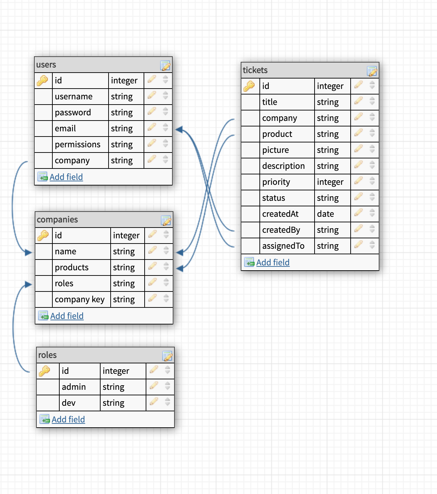

# Project 3 Pitch

## Fork & Clone this repo.

Review the Project 3 [overview](https://romebell.gitbook.io/sei-1019/projects/project-3), [requirement rubric](https://github.com/SEI-ATL/UNIT_3/projects/3), and check out some [examples](https://romebell.gitbook.io/sei-1019/projects/past-projects/project3#project-3-group).

Provide information in the following sections:

---

### Project Overview

Group 1-A: the Orcas: Simone, Jaxon, Edrees, Nicole

Pitch:
“When programmers and users need to report and track a bug, we help provide them a solution with our PDR (Pest Damage Reporter)!”

####

We plan to make a bug tracker that external companies can direct their customers to in order to report issues with their app(s). Customers will be able to efficiently report a short, but useful form that reports a bug. They will be able to submit a who, what, where, how, why, and when along with a snapshot of the error or issue. Company support/dev users will be able to comment and view the reports all users make, so that they have the tools needed to be able to recreate or swiftly identify their bugs. Company admins will also be able to see all bugs submitted, assign bugs to dev members, and communicate with dev team and customers via sockets (chat or realtime notifications). Our app will send a notification to a developer when a bug has been assigned to them or when a bug has been submitted by a user.

##### (Include project idea/concept, project name, who owns git master repo on github, team name [if desired], team member roles, elevator pitch)

---

### Models and Schemas

---

### User Stories

As a customer I want to log on and submit bug reports to the companies whose product that I use. I want to be able to see the tickets I have submitted, their current status, and any related comments.

As a software company I want to sign up users under my company name to manage and address customer submitted bug reports. I want to have admin users who can manage ticket assignment and support accounts (like Devs and Support) who will address bugs, interact with the customer and close out tickets

---

### Wireframes

---

### Additional Technologies

1. Cloudinary
2. Sockets
3. Stretch goal: OAuth for Gmail

##### (MERN Stack expected [MongoDB, Express, React, Node], include any external APIs)

---

### Work Allocation

##### Who is your Gitmaster? Who will be doing what?

-   Simone Schneeberg (git master) + Nicole Hamilton: Backend primarily
-   Jaxon Narramore + Edrees Husseini: Frontend primarily

---

### Daily Sprints

Morning stand up, midday check in, end of day sync up
Work individually, in pairs during the day
Track project status in Trello
Project plan [here](https://docs.google.com/spreadsheets/d/1-onGGf6U8rY8scSbiRc9HUzSSMUltCINBUMw32UQR7g/edit?usp=sharing)

##### (or otherwise general plan for accomplishing tasks, preferably broken down by day)

---

## Make a PR when you're done!
